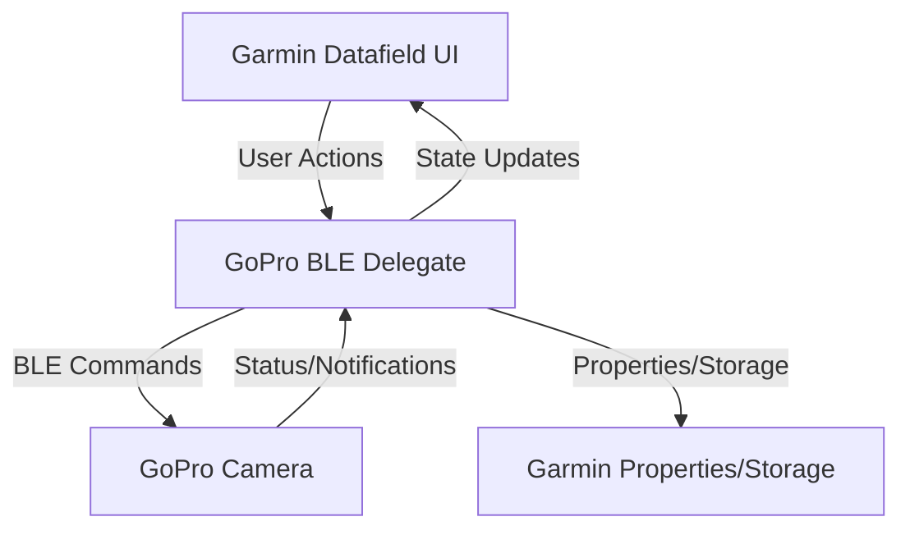
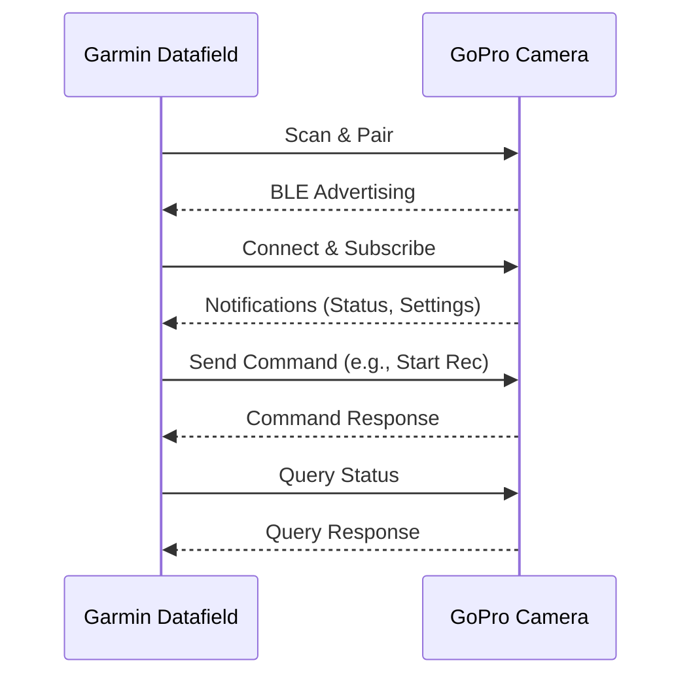
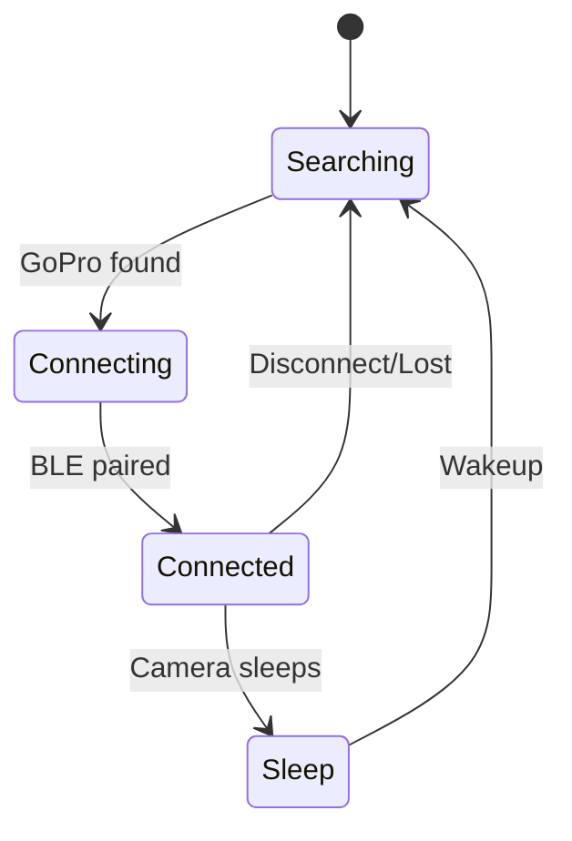

# Garmin GoPro Datafield – Diagrams

This document collects all mermaidjs diagrams for easy reference and visualization.

---

## Architecture Diagram

---

## BLE Communication Flow

---

## State Machine

