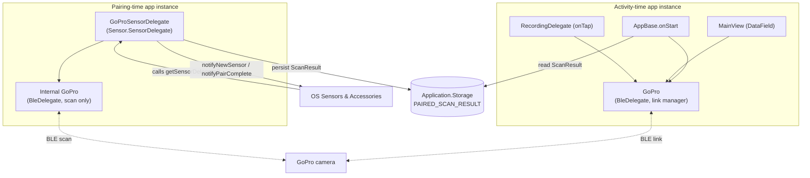
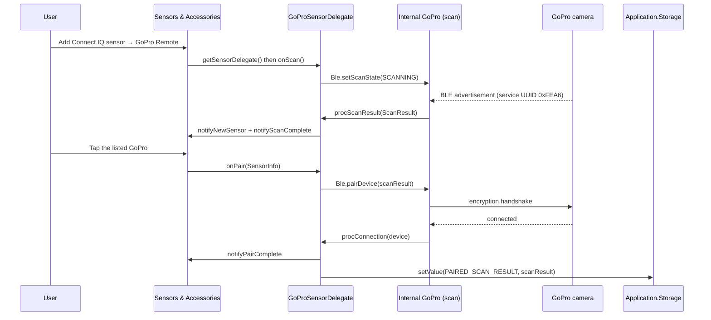
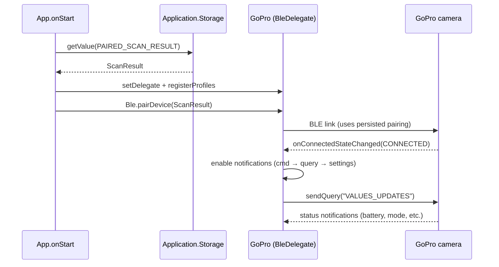
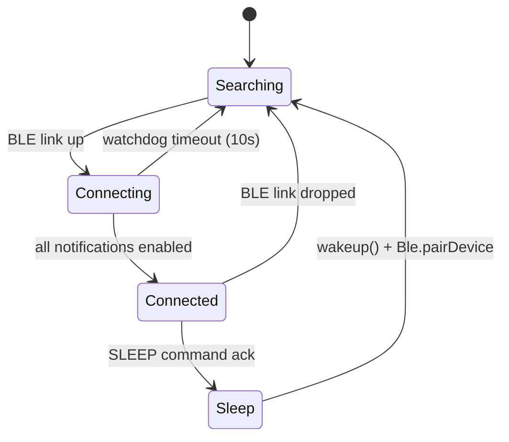

# Garmin GoPro Datafield – Diagrams

The same diagrams as in [technical.md](technical.md), collected for quick
reference.

---

## Architecture

Two app instances bridged by `Application.Storage`. The pairing-time
instance only exists when the user is in Sensors & Accessories; the
activity-time instance only exists while an activity is running.

```mermaid
flowchart TB
    subgraph PairingApp["Pairing-time app instance"]
        SD["GoProSensorDelegate<br/>(Sensor.SensorDelegate)"]
        PB["Internal GoPro<br/>(BleDelegate, scan only)"]
        SD --> PB
    end

    subgraph ActivityApp["Activity-time app instance"]
        AB["AppBase.onStart"]
        AG["GoPro<br/>(BleDelegate, link manager)"]
        MV["MainView (DataField)"]
        RD["RecordingDelegate (onTap)"]
        AB --> AG
        MV --> AG
        RD --> AG
    end

    SYS["OS Sensors &amp; Accessories"]
    STORAGE[("Application.Storage<br/>PAIRED_SCAN_RESULT")]
    HW["GoPro camera"]

    SYS -- "calls getSensorDelegate()" --> SD
    SD -- "notifyNewSensor / notifyPairComplete" --> SYS
    SD -- "persist ScanResult" --> STORAGE
    AB -- "read ScanResult" --> STORAGE
    AG <-. "BLE link" .-> HW
    PB <-. "BLE scan" .-> HW
```

---

## First-time pairing

```mermaid
sequenceDiagram
    participant User
    participant OS as Sensors & Accessories
    participant SD as GoProSensorDelegate
    participant BLE as Internal GoPro (scan)
    participant GP as GoPro camera
    participant ST as Application.Storage

    User->>OS: Add Connect IQ sensor → GoPro Remote
    OS->>SD: getSensorDelegate() then onScan()
    SD->>BLE: Ble.setScanState(SCANNING)
    GP-->>BLE: BLE advertisement (service UUID 0xFEA6)
    BLE->>SD: procScanResult(ScanResult)
    SD->>OS: notifyNewSensor + notifyScanComplete
    User->>OS: Tap the listed GoPro
    OS->>SD: onPair(SensorInfo)
    SD->>BLE: Ble.pairDevice(scanResult)
    BLE->>GP: encryption handshake
    GP-->>BLE: connected
    BLE->>SD: procConnection(device)
    SD->>OS: notifyPairComplete
    SD->>ST: setValue(PAIRED_SCAN_RESULT, scanResult)
```

---

## Activity-time reconnect

```mermaid
sequenceDiagram
    participant App as App.onStart
    participant ST as Application.Storage
    participant GP as GoPro (BleDelegate)
    participant CAM as GoPro camera

    App->>ST: getValue(PAIRED_SCAN_RESULT)
    ST-->>App: ScanResult
    App->>GP: setDelegate + registerProfiles
    App->>GP: Ble.pairDevice(ScanResult)
    GP->>CAM: BLE link (uses persisted pairing)
    CAM-->>GP: onConnectedStateChanged(CONNECTED)
    GP->>GP: enable notifications (cmd → query → settings)
    GP->>CAM: sendQuery("VALUES_UPDATES")
    CAM-->>GP: status notifications (battery, mode, etc.)
```

---

## Connection state machine

```mermaid
stateDiagram-v2
    [*] --> Searching
    Searching --> Connecting: BLE link up
    Connecting --> Connected: all notifications enabled
    Connecting --> Searching: watchdog timeout (10s)
    Connected --> Sleep: SLEEP command ack
    Sleep --> Searching: wakeup() + Ble.pairDevice
    Connected --> Searching: BLE link dropped
```
