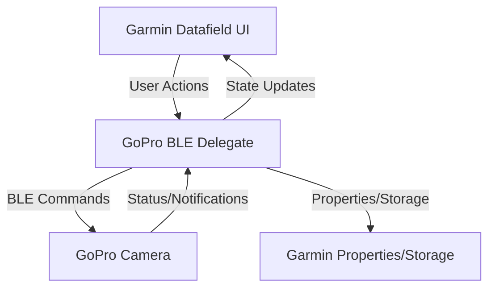
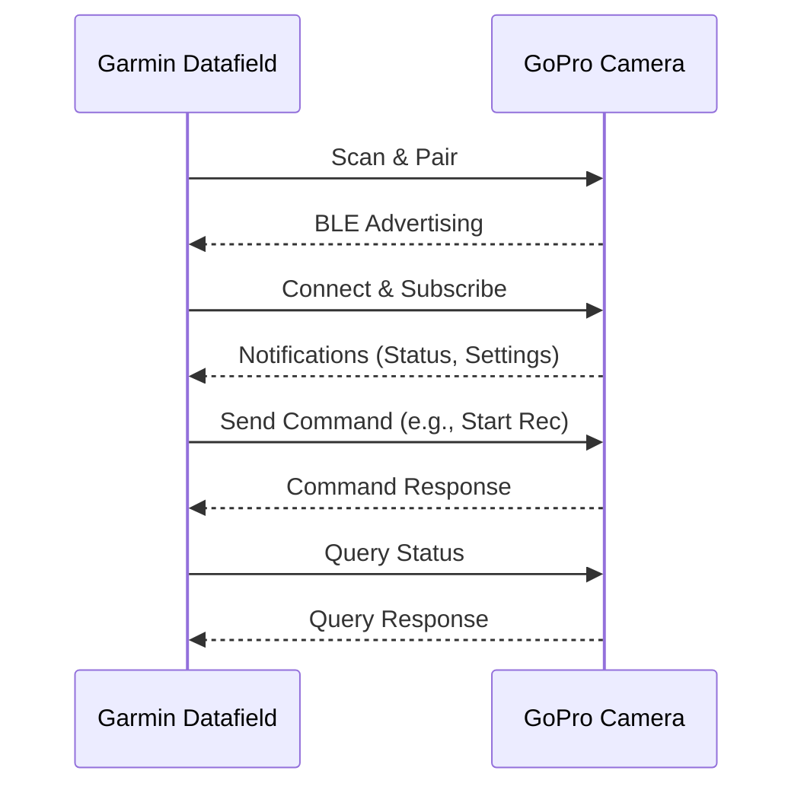
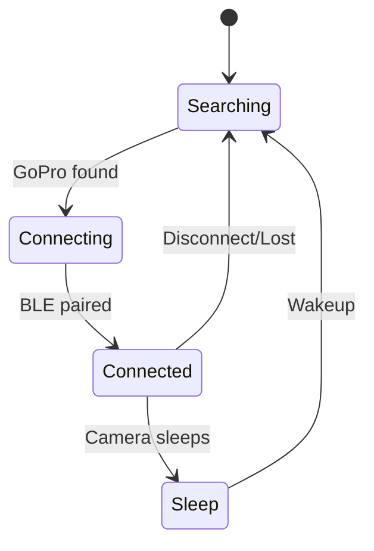

# Garmin GoPro Datafield – Technical Documentation

## Overview

This datafield enables Garmin devices to remotely control GoPro cameras via Bluetooth Low Energy (BLE). It provides a seamless interface for starting/stopping recording, changing presets, and monitoring camera status directly from the Garmin device. The datafield is designed for robustness, ease of use, and extensibility.

---

## Architecture

The datafield is structured around a main BLE delegate class (`GoPro`), which manages all communication with the GoPro camera. The architecture includes:

- **BLE Profile Registration:** Registers the GoPro BLE service and characteristics.
- **Device Scanning & Auto-Detection:** Scans for GoPro cameras, auto-detects and saves camera ID if not set.
- **Command Queueing:** Commands are queued and sent sequentially to ensure reliable BLE communication.
- **Notification Handling:** Subscribes to and processes notifications for command, query, and settings updates.
- **Simulation Mode:** Allows for development and testing without a physical GoPro, using hardcoded base64-encoded preset data.
- **Debug Logging:** When parsing preset responses, the raw BLE data is logged as a base64 string for troubleshooting and simulation.

### Architecture Diagram

---

## BLE Communication Flow

- **Scanning:** Initiated on startup or when connection is lost. Scans for BLE devices advertising the GoPro service UUID.
- **Pairing:** If no camera ID is set, the first GoPro found is paired and its ID is saved.
- **Connection:** On successful pairing, the datafield subscribes to required notifications.
- **Command Sending:** Commands (e.g., start/stop recording) are enqueued and sent over BLE.
- **Querying:** Periodic or on-demand queries fetch camera status and settings.
- **Notification Handling:** BLE notifications are parsed to update UI and internal state.
- **Debug Logging:** When a preset is received, the raw BLE response is logged as a base64 string for easier debugging and simulation.

### BLE Flow Diagram

---

## State Machine

The datafield maintains a connection state:
- **Searching**: Scanning for GoPro cameras.
- **Connecting**: Attempting to pair/connect.
- **Connected**: Ready for commands and queries.
- **Sleep**: Camera is in sleep mode.

### State Transition Diagram

---

## Command Queueing

Commands are enqueued and sent one at a time. After each command is sent, the next is processed. This ensures BLE reliability and prevents command loss.

---

## Camera Auto-Detection & Pairing

- If no camera ID is set, the datafield connects to the first GoPro found and saves its ID for future use.
- If a camera ID is set, only devices matching that ID are connected.
- Pairing status is stored in Garmin Storage.

---

## Simulation Mode

- When enabled, all BLE operations are simulated.
- Preset data is loaded from a hardcoded base64 string, mimicking real GoPro responses.
- Useful for development and testing without hardware.
- Simulated responses mimic real GoPro data.

---

## Debug Logging for Preset Responses

- When a preset response is received (not in simulation mode), the raw BLE data is logged as a base64 string.
- This base64 string can be used for simulation or troubleshooting.
- Example log: `[DEBUG] queryResponse (base64) for preset: <base64-string>`

---

## Key Data Structures

- **Command Queue:** Array of pending commands.
- **Preset Groups:** Stores available camera presets.
- **Status Variables:** Battery, recording, mode, etc.

---

## Error Handling & Robustness

- All BLE operations are wrapped in try/catch blocks.
- Connection and notification failures trigger state resets and retries.
- Properties and storage access is always null-checked.
- Debug logging helps diagnose protocol and Protobuf decoding issues.

---

## Extensibility

- New commands and queries can be added to the `commands` map.
- Additional BLE characteristics can be registered as needed.
- Simulation mode can be extended for more test scenarios.

---

## File Structure

- `GoPro.mc`: Main BLE logic and state machine.
- `MainView.mc`: UI logic.
- `SettingsMenu.mc`: User settings.
- `Util.mc`: Utility functions.
- `build.sh`: Build automation script.

---

## See Also
- [User Manual](user_manual.md)
- [Diagrams](diagrams.md)
