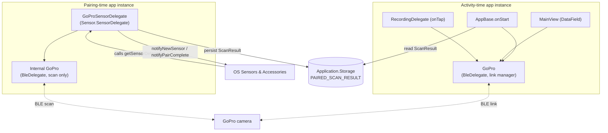
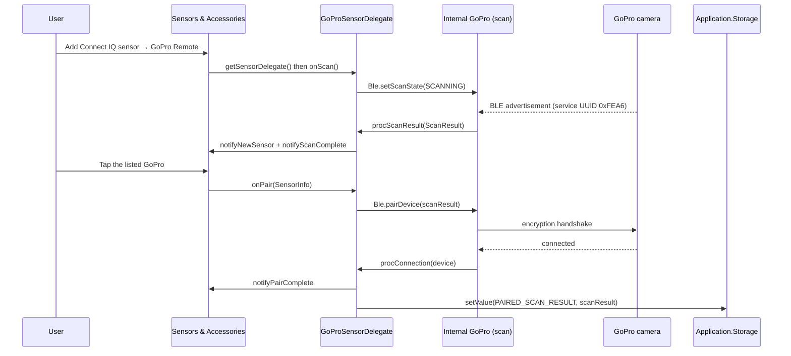
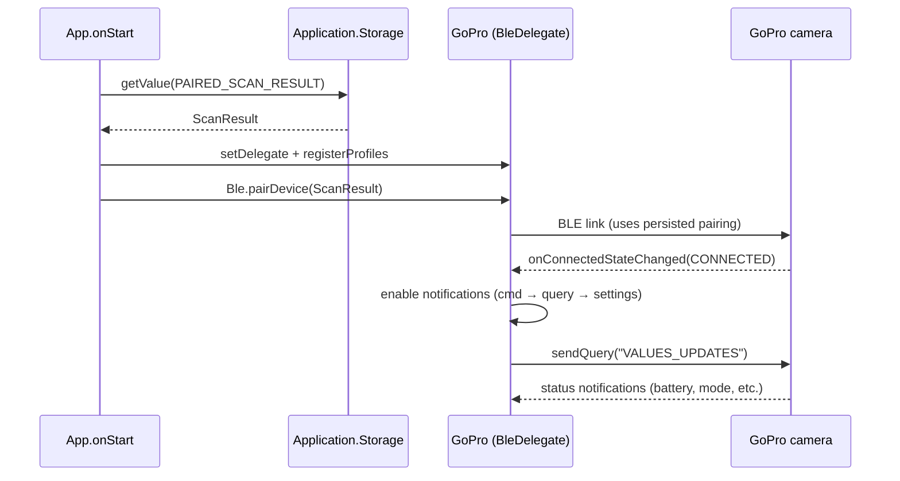
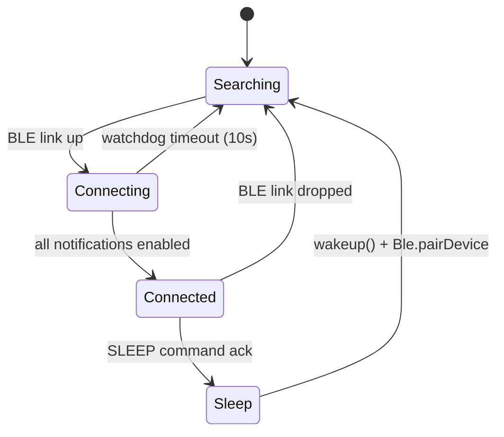

# Garmin GoPro Datafield – Technical Documentation

## Overview

This data field controls a GoPro camera over Bluetooth Low Energy (BLE) from
inside a Garmin activity. It targets touch-capable Garmin devices on Connect IQ
**5.1.0 or higher** (the floor for `Sensor.SensorDelegate`-based native pairing,
required by SDK 8.2+ for data fields using BLE).

Pairing is delegated to the device's system **Sensors & Accessories** menu:
the user pairs their GoPro there once, the resulting BLE `ScanResult` is
persisted, and the data field reconnects automatically each activity.

---

## Architecture

The code splits across two app instances that the Connect IQ framework
constructs separately and that **do not share live state**:

1. **Pairing-time instance** — created by the framework when the user opens
   Sensors & Accessories → Connect IQ. `GarminGoProDatafieldApp.getSensorDelegate()`
   returns a fresh `GoProSensorDelegate`. That delegate constructs its own
   `GoPro` BLE delegate for the scan, drives `Ble.setScanState`, hands found
   GoPros up to the OS via `Sensor.notifyNewSensor`, and on pair completion
   persists the `ScanResult` to `Application.Storage[$.PAIRED_SCAN_RESULT]`.

2. **Activity-time instance** — created when the user starts an activity that
   contains the data field. `AppBase.onStart` constructs a new `GoPro` BLE
   delegate, reads `$.PAIRED_SCAN_RESULT` from Storage, and calls
   `Ble.pairDevice(paired)`. The OS-level pairing brought up in (1) means the
   BLE link comes up without re-scanning.

`Application.Storage` is the **only** state bridge between (1) and (2) — they
run in different app processes and cannot see each other's class instances.

### File layout

```
source/
├── GarminGoProDatafield.mc   AppBase + getSensorDelegate() factory
├── GoProSensorDelegate.mc    Pairing-time Sensor.SensorDelegate
├── GoPro.mc                  BLE delegate, protocol decoder, FSM
├── MainView.mc               DataField view (compute + onUpdate)
├── RecordingDelegate.mc      Touch input handling (onTap)
├── ScreenCoordinates.mc      Hit-region rectangles for buttons
├── PresetGroups.mc           Protobuf preset-list decoder + cache
└── Util.mc                   Duration formatter

generated_protobuf/           protoc-gen-monkeyc output
├── preset_status.mc          Hero 9+ preset data structures
├── request_get_preset_status.mc
└── response_generic.mc

ProtobufLib/                  Monkey-C protobuf runtime (varint, decoder,
                              encoder primitives). Imported as a barrel.

layouts-square/Layout.mc      Edge bike computers, venux1, etrextouch
layouts-round/Layout.mc       All round watches
layouts-square-lowres/        (currently unused; kept for future low-res
                              square devices)
```

### Architecture diagram


```mermaid
flowchart TB
    subgraph PairingApp["Pairing-time app instance"]
        SD["GoProSensorDelegate<br/>(Sensor.SensorDelegate)"]
        PB["Internal GoPro<br/>(BleDelegate, scan only)"]
        SD --> PB
    end

    subgraph ActivityApp["Activity-time app instance"]
        AB["AppBase.onStart"]
        AG["GoPro<br/>(BleDelegate, link manager)"]
        MV["MainView (DataField)"]
        RD["RecordingDelegate (onTap)"]
        AB --> AG
        MV --> AG
        RD --> AG
    end

    SYS["OS Sensors &amp; Accessories"]
    STORAGE[("Application.Storage<br/>PAIRED_SCAN_RESULT")]
    HW["GoPro camera"]

    SYS -- "calls getSensorDelegate()" --> SD
    SD -- "notifyNewSensor / notifyPairComplete" --> SYS
    SD -- "persist ScanResult" --> STORAGE
    AB -- "read ScanResult" --> STORAGE
    AG <-. "BLE link" .-> HW
    PB <-. "BLE scan" .-> HW
```

---

## BLE Communication Flow

### First-time pairing (user-driven, in Sensors & Accessories)


```mermaid
sequenceDiagram
    participant User
    participant OS as Sensors & Accessories
    participant SD as GoProSensorDelegate
    participant BLE as Internal GoPro (scan)
    participant GP as GoPro camera
    participant ST as Application.Storage

    User->>OS: Add Connect IQ sensor → GoPro Remote
    OS->>SD: getSensorDelegate() then onScan()
    SD->>BLE: Ble.setScanState(SCANNING)
    GP-->>BLE: BLE advertisement (service UUID 0xFEA6)
    BLE->>SD: procScanResult(ScanResult)
    SD->>OS: notifyNewSensor + notifyScanComplete
    User->>OS: Tap the listed GoPro
    OS->>SD: onPair(SensorInfo)
    SD->>BLE: Ble.pairDevice(scanResult)
    BLE->>GP: encryption handshake
    GP-->>BLE: connected
    BLE->>SD: procConnection(device)
    SD->>OS: notifyPairComplete
    SD->>ST: setValue(PAIRED_SCAN_RESULT, scanResult)
```

### Activity-time reconnect (every activity start)


```mermaid
sequenceDiagram
    participant App as App.onStart
    participant ST as Application.Storage
    participant GP as GoPro (BleDelegate)
    participant CAM as GoPro camera

    App->>ST: getValue(PAIRED_SCAN_RESULT)
    ST-->>App: ScanResult
    App->>GP: setDelegate + registerProfiles
    App->>GP: Ble.pairDevice(ScanResult)
    GP->>CAM: BLE link (uses persisted pairing)
    CAM-->>GP: onConnectedStateChanged(CONNECTED)
    GP->>GP: enable notifications (cmd → query → settings)
    GP->>CAM: sendQuery("VALUES_UPDATES")
    CAM-->>GP: status notifications (battery, mode, etc.)
```

### Watchdog recovery

`GoPro` runs a 10-second watchdog (`onConnectingTimeout`) covering the
`Ble.pairDevice` → all-notifications-enabled chain. If the BLE state stalls
mid-handshake (a Hero 13 misreport, a flaky link, a notification descriptor
that never ACKs), the watchdog:

1. Calls `Ble.unpairDevice(device)`,
2. Resets the notification-enabled flags,
3. Re-reads `PAIRED_SCAN_RESULT` from Storage and calls `Ble.pairDevice` again.

This avoids the old "stuck on SEARCHING forever" symptom.

---

## State Machine

`GoPro.connectionStatus` holds one of four values defined in the enum:

| Constant | Meaning |
|---|---|
| `STATUS_SEARCHING` | No live BLE link; waiting on `onConnectedStateChanged(CONNECTED)` |
| `STATUS_CONNECTING` | BLE link is up but the cmd/query/settings notifications aren't all enabled yet |
| `STATUS_CONNECTED` | All three notifications enabled, ready for commands |
| `STATUS_SLEEP` | Camera acknowledged a SLEEP command |


```mermaid
stateDiagram-v2
    [*] --> Searching
    Searching --> Connecting: BLE link up
    Connecting --> Connected: all notifications enabled
    Connecting --> Searching: watchdog timeout (10s)
    Connected --> Sleep: SLEEP command ack
    Sleep --> Searching: wakeup() + Ble.pairDevice
    Connected --> Searching: BLE link dropped
```

Pairing itself sits *outside* this FSM — it happens once per device in the
Sensors & Accessories flow and is owned by the OS afterward.

---

## Command and Query Pipeline

Commands and queries share the `commands` dictionary in `GoPro.mc` (a
ByteArray per name). They differ in characteristic:

- Commands → `COMMAND_CHAR` UUID, response on `COMMAND_NOTIFICATION`.
- Queries → `QUERY_CHAR` UUID, response on `QUERY_NOTIFICATION`.

Both go through a per-write queue (`commandQueue`). `startSendingCommands`
drains it sequentially: after each `requestWrite`, the next is sent from
`onCharacteristicWrite`. This prevents the GoPro from dropping writes when
they arrive faster than it can ACK.

Status updates arrive on `SETTINGS_NOTIFICATION` after the data field
subscribes via `SETTINGS_UPDATES`/`VALUES_UPDATES`. The notification payload
is a fragmented byte stream — `accumulateQueryResponses` reassembles a full
frame before `parseQueryResponse` decodes it into the `GoPro` fields
(battery, mode, modeId, resolution, fps, etc.).

Preset lists arrive on the same channel but use a longer fragmented payload
that's protobuf-encoded. `PresetGroups` lazily decodes them on the next
`compute()` tick to keep the BLE callback short.

---

## Simulation Mode

`SIMULATION_MODE` is a `const` in `GoPro.mc`. When true:

- `sendCommand` / `sendQuery` / `enableNotifications` short-circuit and log
  instead of touching BLE.
- `accumulateQueryResponses` injects a hardcoded base64 preset payload so
  the rest of the parsing pipeline can be exercised.
- `MainView.onUpdate` forces `STATUS_CONNECTED` and a synthetic `modeId` so
  the UI renders fully.

The base64 blob in `parseQueryResponse` is a real Hero 13 capture taken from
the `[DEBUG] queryResponse (base64) for preset:` log line. Capturing a new
one from another camera lets you simulate that model.

`build.sh dev` flips this constant on; `build.sh build` and `build.sh release`
flip it off.

---

## Type-Check Discipline

The whole project compiles **strict (`-l 3`) clean** on all 55 manifest
products. Hand-written sources are fully type-annotated; generated protobuf
code is emitted with annotations by `protoc-gen-monkeyc`. CI/sanity runs
should keep `-l 3` so regressions surface immediately.

---

## Key Storage Keys (`Application.Storage`)

| Key | Type | Purpose |
|---|---|---|
| `paired_scan_result` (`$.PAIRED_SCAN_RESULT`) | `Ble.ScanResult` | Persisted pairing, bridges pairing-time and activity-time instances |
| `lastPresetGroupResult` | base64 String | Last raw protobuf preset-list payload (debug aid) |
| `lastPresetGroupUploaded` | Boolean | Flag for one-shot diagnostic upload |

Properties (`Application.Properties`) hold three user-tunable switches:

| Property | Default | Effect |
|---|---|---|
| `keepalive` | false | Send periodic KEEPALIVE so the GoPro doesn't auto-sleep |
| `auto_stop` | false | Toggle GoPro recording when the activity timer starts/stops |
| `auto_reconnect` | false | Set `shouldConnect = true` on BLE disconnect so reconnects happen automatically |

(There used to be a `gopro_id` numeric property for the manual-pairing flow.
It was removed once SensorDelegate replaced manual entry.)

---

## See Also

- [Developer workflow](dev.md) — build, simulator, regenerating protobuf
- [User manual](user_manual.md) — end-user pairing and operation
- [Diagrams](diagrams.md) — the same diagrams as above, collected

---

## Simulator limitations

The Connect IQ simulator doesn't implement the entire `Sensor.SensorDelegate`
flow end-to-end. In particular:

- `Sensor.notifyPairComplete` may surface a "not implemented" dialog on
  some device targets (observed on Edge 850 / 1050 simulators with SDK
  9.1.0). The simulator's sensor list still shows the row as "Paired", but
  the activity-time path that reads `PAIRED_SCAN_RESULT` may not have
  anything to read.
- The simulator's "Add Scan Result" panel populates names/UUIDs but does
  not actually fire all of the `onConnectedStateChanged(CONNECTED)`
  notifications a real device would deliver, so the full notification-
  enable chain (cmd → query → settings) won't run in sim.

To smoke-test the activity-time reconnect path without leaning on the full
pairing flow, you can synthesize a ScanResult into Storage from the
simulator's REPL/debug console (or temporarily hardcode it in `onStart`).
End-to-end validation must happen on real hardware.

## Native Pairing Simulator Test Plan

Run after any change to `GoPro.mc`, `GoProSensorDelegate.mc`, or
`GarminGoProDatafield.mc`. Reference target: Edge 1040 simulator.

### Fresh-install pairing

1. Build: `./build.sh dev key_path`
2. Open `bin/GarminGoProWidget.prg` in the CIQ simulator (Edge 1040):
   `monkeydo bin/GarminGoProWidget.prg edge1040 -n`. The `-n` flag enables
   native-pairing mode — without it, the simulator's Sensors & Accessories
   Connect IQ section is hidden.
3. Add the data field to an activity profile.
4. Navigate to Sensors & Accessories.
5. **Expected:** "GoPro Remote" appears under Connect IQ.
6. Tap it → `onScan()` fires → `Ble.setScanState(SCANNING)`.
7. In the simulator's BLE panel: **Add Scan Result** with service UUID
   `0000fea6-0000-1000-8000-00805f9b34fb` and a name like `GoPro 1624`.
8. **Expected:** the scan result appears in the system pairing UI.
9. Tap it → `onPair()` → `Ble.pairDevice()` → `onConnectedStateChanged(CONNECTED)`
   → `procConnection` → `Sensor.notifyPairComplete`.
10. **Expected:** the system marks the sensor as paired and
    `Application.Storage["paired_scan_result"]` is populated.

### Reconnect across restart

1. With the GoPro paired from the prior test, stop the simulator.
2. Restart the simulator and reopen the .prg.
3. **Expected:** `App.onStart` reads `paired_scan_result` from Storage and
   calls `Ble.pairDevice` directly. No scan UI is shown.
   `onConnectedStateChanged(CONNECTED)` fires shortly.

### Unpair flow

1. From a paired state: Sensors & Accessories → GoPro Remote → Remove.
2. **Expected:** `onUnpair()` runs, `Sensor.notifyUnpairComplete` is called,
   `paired_scan_result` is deleted from Storage.

### Watchdog recovery

1. While `STATUS_CONNECTING` (between BLE connect and all-notifications-enabled),
   simulate a stall by ignoring the descriptor-write ACK.
2. **Expected:** after 10s, watchdog logs `connecting watchdog fired — resetting
   and re-pairing`, unpairs, and re-pairs from the stored ScanResult.
